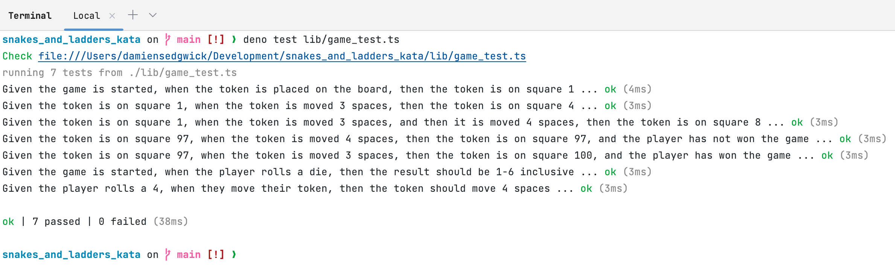
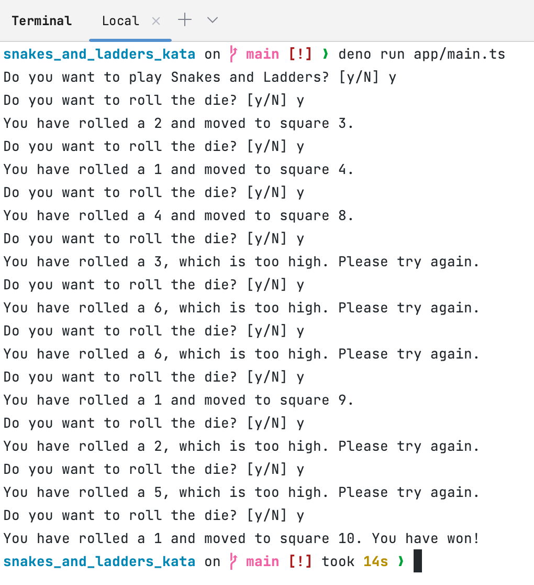

# Snakes and Ladders Kata

This is a simple implementation of the Snakes and Ladders Kata in TypeScript
(using Deno).

The Kata is described here: https://agilekatas.co.uk/katas/SnakesAndLadders-Kata

## Feature 1 - Moving Your Token

### Token Can Move Across the Board

_As a player I want to be able to move my token So that I can get closer to the
goal:_

- [x] Given the game is started, when the token is placed on the board, then the
      token is on square 1
- [x] Given the token is on square 1, when the token is moved 3 spaces, then the
      token is on square 4
- [x] Given the token is on square 1, when the token is moved 3 spaces, and then
      it is moved 4 spaces, then the token is on square 8

### Player Can Win the Game

_As a player I want to be able to win the game So that I can gloat to everyone
around:_

- [x] Given the token is on square 97, when the token is moved 3 spaces, then
      the token is on square 100, and the player has won the game
- [x] Given the token is on square 97, when the token is moved 4 spaces, then
      the token is on square 97, and the player has not won the game

### Moves Are Determined By Dice Rolls

_As a player I want to move my token based on the roll of a die So that there is
an element of chance in the game:_

- [x] Given the game is started, when the player rolls a die, then the result
      should be 1-6 inclusive
- [x] Given the player rolls a 4, when they move their token, them the token
      should move 4 spaces

# Decisions and Assumptions

On the whole, I found this particular coding exercise to be quite enjoyable. It
enabled me to express myself by choosing the language and tools that I wanted to
use and I decided to write the solution in TypeScript, using Deno as the runtime.

I decided to use Deno as the runtime due to the fact that it is a secure runtime
for JavaScript and comes with a built-in test runner. I also decided to use
TypeScript so that the solution benefited from static typing and great type
inference, although I prefer to explicitly type my code for the most part.

I also decided to use a functional programming style for the solution, as it is
a paradigm that I am very familiar with and I find it to be a very expressive. I
also find it to be easier to reason about and test than writing OOP code.

I assumed that the solution would be run from the command line and that the
output would be printed to the console. I also assumed that the solution would
be run turn by turn, with the user pressing the enter key to move to the next
turn.

## How to run the solution

1. Install Deno: https://deno.land/#installation
2. Run the solution: `deno run app/main.ts`
3. Run the tests: `deno test lib/game_test.ts`

*I have attached a couple of screenshots of the solution running and the tests 
at the bottom of this README.md in case you do not have Deno installed or do not
want to install Deno*

# Retrospective - Love, Loathe, Like, Learn

## Love
- The opportunity to build something a little different in comparison to other coding exercises.
- The conciseness of the coding exercise, it did not take too long to implement the solution.

## Loathe
- Leaving the developer to interpret the requirements what "running the solution" meant.

## Like
- The chance to write some functional programming in TypeScript.
- The chance to write some unit tests in TypeScript.

## Learn
- How to create helper functions for better re-usability when writing unit tests.

# Screenshots

